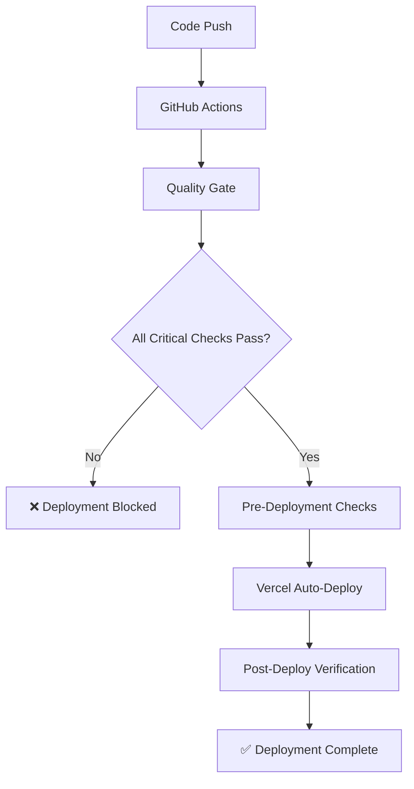

# 🚀 AXIS6 Deployment Pipeline Documentation

## Overview
Comprehensive automated deployment pipeline with quality gates, security checks, and post-deployment verification.

## 📋 Pipeline Components

### 1. Pre-Deployment (`npm run deploy:pre`)
**Script**: `scripts/pre-deploy.js`
- ✅ Environment variables validation
- ✅ TypeScript type checking
- ✅ ESLint code quality (strict mode)
- ✅ Unit test execution
- ✅ Production build verification
- ✅ Security headers validation
- ✅ Bundle analysis generation
- ✅ Deployment readiness report

### 2. GitHub Actions CI/CD (`.github/workflows/ci-cd.yml`)
**Quality Gate**:
- ✅ Node.js 20 setup
- ✅ Dependency installation
- ✅ Type checking
- ✅ ESLint validation
- ✅ Security scanning
- ✅ Test execution
- ✅ Production build
- ✅ Bundle analysis

**Deployment Check**:
- ✅ Pre-deployment verification
- ✅ Environment validation
- ✅ Deployment report generation

**Post-Deploy**:
- ✅ Health endpoint verification
- ✅ Security headers check
- ✅ Performance benchmarking
- ✅ Lighthouse audit

### 3. Post-Deployment (`npm run deploy:post`)
**Script**: `scripts/post-deploy.js`
- ✅ Multi-environment health checks
- ✅ Security headers validation
- ✅ Performance benchmarking
- ✅ API endpoint verification
- ✅ Response time analysis

## 🔧 Available Commands

### Development
```bash
npm run dev                    # Start development server
npm run lint                   # Check code quality
npm run lint:fix              # Auto-fix linting issues
npm run test:coverage         # Run tests with coverage
npm run type-check            # TypeScript validation
```

### Quality Assurance
```bash
npm run lint:strict           # Strict linting (fail on warnings)
npm run lint:summary          # Detailed linting report
npm run security:headers      # Security headers check
npm run analyze               # Bundle analysis
npm run analyze:report        # Bundle analysis report
```

### Deployment Pipeline
```bash
npm run deploy:pre            # Pre-deployment checks
npm run deploy:post           # Post-deployment verification
npm run deploy:full           # Complete deployment cycle
npm run production:health     # Production health check
```

## 🎯 Quality Gates

### Critical (Must Pass)
- ✅ Environment variables present
- ✅ TypeScript compilation successful
- ✅ Production build successful
- ✅ Security headers configured

### Important (Warnings)
- ⚠️ ESLint issues (won't block deployment)
- ⚠️ Test failures (logged but not blocking)
- ⚠️ Bundle size recommendations

## 🚦 Deployment Flow



## 📊 Monitoring & Alerts

### Health Checks
- **Landing Page**: 200 OK
- **API Health**: `/api/health`
- **Authentication**: Login/Register pages
- **Dashboard**: Protected routes (302 redirect)

### Performance Metrics
- **Response Time**: < 1000ms (Excellent)
- **Bundle Size**: 2.36MB client bundle
- **Security Score**: 6/6 headers present

### Security Validation
- ✅ Content-Security-Policy
- ✅ X-Content-Type-Options
- ✅ X-Frame-Options
- ✅ X-XSS-Protection
- ✅ Referrer-Policy
- ✅ Strict-Transport-Security

## 🛠️ Configuration

### Environment Variables (Required)
```bash
NEXT_PUBLIC_SUPABASE_URL=https://nvpnhqhjttgwfwvkgmpk.supabase.co
NEXT_PUBLIC_SUPABASE_ANON_KEY=your_anon_key
SUPABASE_SERVICE_ROLE_KEY=your_service_key
```

### Optional Variables
```bash
VERCEL_TOKEN=your_vercel_token
RESEND_API_KEY=your_resend_key
SENTRY_DSN=your_sentry_dsn
```

## 🚨 Rollback Procedures

### Automatic Rollback
```bash
git revert HEAD
git push origin main
# Vercel will auto-deploy the rollback
```

### Manual Rollback
1. Navigate to Vercel dashboard
2. Select previous deployment
3. Click "Promote to Production"
4. Verify with `npm run deploy:post`

## 📈 Continuous Improvement

### Metrics to Track
- Deployment frequency
- Lead time for changes
- Mean time to recovery
- Change failure rate

### Optimization Opportunities
- Bundle size reduction (date-fns tree shaking)
- Test coverage improvement (currently at baseline)
- Performance optimization (< 500ms target)
- Security enhancements (CSP nonce implementation)

## 🔗 Related Documentation
- `FINAL_AUDIT_REPORT_2025-08-26.md` - Production audit results
- `next.config.js` - Build and security configuration
- `.eslintrc.json` - Code quality rules
- `jest.config.js` - Testing configuration

---

**Last Updated**: August 26, 2025  
**Pipeline Status**: ✅ Fully Operational  
**Next Review**: Weekly pipeline health check